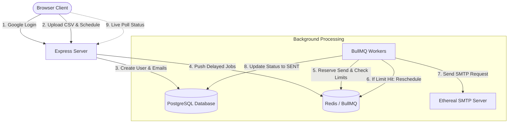

# ReachInbox Email Scheduler & Dashboard

A reliable, highly scalable email campaign scheduler and tracking dashboard. Built using a modern full-stack TypeScript architecture, this application allows users to authenticate via Google OAuth, parse lists of leads (via CSV/Text), and schedule staggered email campaigns with granular concurrency controls, thread-safe throttling, and fixed-window (hourly) rate-limiting.

---

## 🚀 Key Features

* **Google OAuth 2.0 Login**: Secure, session-cookie-based authentication. Remembers user profiles and loads Google avatar/email.
* **Leads File Parser**: Client-side CSV/Text reader that extracts and deduplicates email addresses automatically, rendering them as tags.
* **Persistent Delayed Queue**: Powered by **BullMQ** and **Redis** to ensure scheduled emails survive server crashes or restarts.
* **Granular Rate-Limiting**: Thread-safe Redis fixed-window (hourly) checks per sender profile to reschedule emails to the next hour if limits are reached (preserving sending order).
* **Smart Throttling (Sender Spacing)**: Enforces a configurable minimum delay between consecutive emails per sender profile using Redis reservation timestamps.
* **Idempotency Checks**: Database-level tracking of `PENDING`, `PROCESSING`, `SENT`, and `FAILED` states to prevent double-sending under concurrency.
* **Live Status Dashboard**: Automatically polls the backend database in the background. As emails are sent, they move from the **Scheduled** tab to the **Sent** tab in real-time.
* **SMTP Transport**: Integrates with Nodemailer (defaulted to Ethereal SMTP for sandboxed testing).
* **Structured Logger**: Colored console logs and persistent file logs (`combined.log`, `error.log`).

---

## 🛠️ Tech Stack

### Backend
* **Runtime**: Node.js + TypeScript
* **Framework**: Express.js
* **Database**: PostgreSQL (via Prisma ORM)
* **Job Queue & Cache**: Redis + BullMQ
* **Auth**: Passport.js (Google OAuth 2.0 Strategy) + Express-Session
* **Mailer**: Nodemailer

### Frontend
* **Build Tool**: Vite + TypeScript
* **Library**: React 19
* **Styling**: Tailwind CSS v4 (native compiler plugin)
* **Icons**: Lucide Icons
* **API Client**: Axios (configured with cross-origin credentials)

---

## 📐 Architecture Overview



1. **Scheduling**: When a campaign is submitted, the backend creates `Email` records in PostgreSQL marked as `PENDING` and pushes corresponding delayed jobs into **BullMQ** with the target delay.
2. **Idempotency & Send**: When a BullMQ worker picks up a job:
   * It checks PostgreSQL to make sure it is not already `SENT` or `PROCESSING`.
   * It checks Redis for sender rate limits (maximum emails/hour) and spacing delays.
3. **Throttling & Rescheduling**: If a limit is hit, the job is automatically rescheduled to the next available slot, maintaining transaction safety under concurrency.
4. **Delivery**: The email is sent via SMTP, and its database state is updated to `SENT` or `FAILED`.

---

## ⚠️ Important Deployment & Infrastructure Note

> [!IMPORTANT]
> **Active Email Sending Limitations on Live Demo (Render)**
>
> The live cloud deployment on Render **does not transmit actual emails** via Ethereal SMTP. Render's Free tier blocks all outbound SMTP ports (`25`, `465`, and `587`) as a standard anti-spam measure. 
> 
> * **What works in live deployment**: Google OAuth login, campaign creation, lead file uploading, database operations, status updates, and the real-time polling dashboard.
> * **What works locally**: All outbound email-sending and SMTP processes are fully functional and verified in the local workspace environment (see demo walkthrough video).

### Real-World Production Fixes (How to resolve this constraint):
1. **Transactional Email APIs via HTTPS**: Use an email service provider with an HTTP API client (such as Resend, SendGrid, or Mailgun) to transmit emails over secure HTTP port `443` instead of raw SMTP ports, which bypasses port blocking entirely.
2. **Upgrade Render Tier**: Upgrading to a paid tier on Render lifts the outbound SMTP restriction.
3. **Alternative Cloud Providers**: Deploy the backend service to a virtual private server (e.g., DigitalOcean Droplet, AWS EC2) or a hosting provider that does not block outbound SMTP ports by default (such as Railway or Fly.io).

### Project Context & Constraints:
Given the assignment's 48-hour window and Ethereal SMTP being a hard requirement, I prioritized the correctness and security of the local implementation and documented this cloud infrastructure constraint rather than reworking the email provider integration under time pressure.

---

## ⚙️ Setup and Installation

### Prerequisites
* [Docker Desktop](https://www.docker.com/products/docker-desktop/) (for PostgreSQL and Redis)
* [Node.js](https://nodejs.org/) (v18+)

### Step 1: Spin up Databases
Run the following command in the project root to start PostgreSQL (port `5433` to prevent local collisions) and Redis (`6379`):
```bash
docker compose up -d
```

### Step 2: Configure Backend Environment
1. Navigate to the `backend` folder:
   ```bash
   cd backend
   ```
2. Copy `.env.example` to `.env`:
   ```bash
   cp .env.example .env
   ```
3. Fill out the environment variables in `.env`:
   * Obtain **Google Client ID** and **Client Secret** from the [Google Cloud Console](https://console.cloud.google.com/).
     * *Note: In your Google credentials settings, register your **Authorized redirect URIs** to include: `http://localhost:5000/api/auth/google/callback`*
   * Set `SESSION_SECRET` to a random cryptographic string.
   * Provide your Ethereal SMTP user/password if you want to inspect test inboxes.

### Step 3: Sync Database Schema
Install dependencies and sync the schema to create PostgreSQL tables:
```bash
npm install
npx prisma db push
```

### Step 4: Start the Backend Server
Start the Express API and background workers:
```bash
npm run dev
```

### Step 5: Start the Frontend App
1. Open a new terminal and navigate to the `frontend` folder:
   ```bash
   cd ../frontend
   ```
2. Install dependencies and start the Vite development server:
   ```bash
   npm install
   npm run dev
   ```
3. Open `http://localhost:5173/` in your browser.

---

## 🧪 Testing Guidelines

1. **Google Auth**: Click "Login with Google". You will be redirected to Google for authentication and returned to your personalized dashboard showing your profile picture, name, and email.
2. **Compose and Throttle**:
   * Click **Compose**.
   * Select your sender email dropdown.
   * Click **Upload List** and select a `.txt` or `.csv` file containing emails.
   * Enter a Subject, Body, and set your **Delay between 2 emails** (e.g. `5` seconds).
   * Click **Send**.
3. **Live Updates**: Go to the **Scheduled** tab. You will see your emails queue up. Watch them disappear one-by-one every 5 seconds and pop up in the **Sent** tab.
4. **Crash Survival**: Schedule a large batch of emails, stop your backend console server midway, and restart it. You will observe that queue processing resumes seamlessly from where it stopped, without duplicating any already-sent emails.
